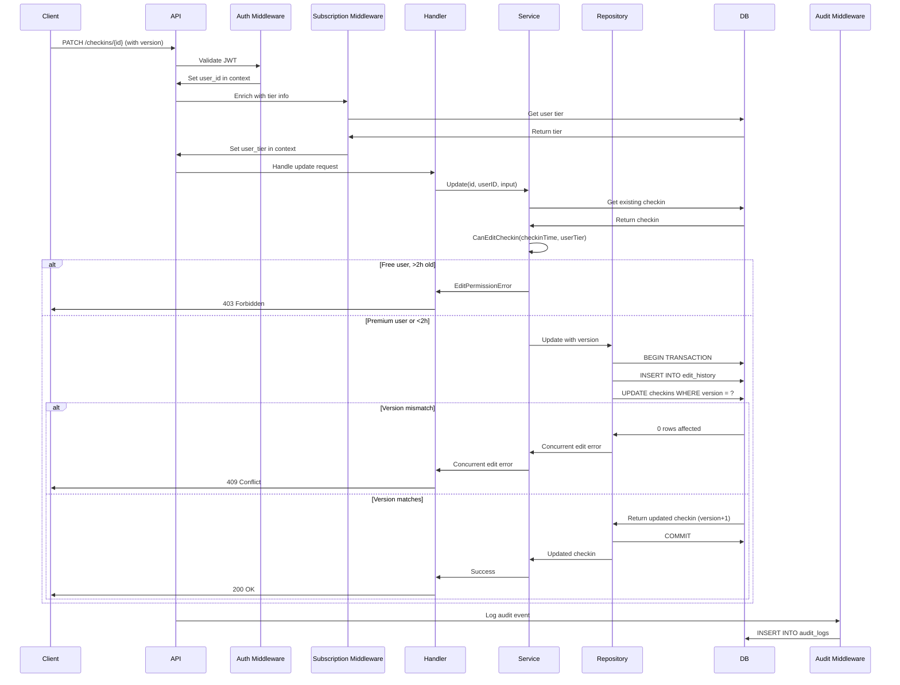

# Premium Historical Edit API Integration

## Overview

This document describes the integrated premium historical edit feature for check-ins, which combines subscription validation, time boundary checks, optimistic locking, audit logging, and edit history preservation.

## Architecture Components

### 1. Subscription Middleware (`middleware.SubscriptionMiddleware`)
- **Location**: `/internal/middleware/subscription.go`
- **Responsibility**: Enriches request context with user tier information
- **Flow**:
  - Extracts `user_id` from auth middleware
  - Fetches user tier from database
  - Validates tier expiration
  - Sets `user_tier` in context

### 2. Time Boundary Validation (`checkin.CanEditCheckin`)
- **Location**: `/internal/checkin/time_utils.go`
- **Responsibility**: Enforces 2-hour edit window for free users
- **Rules**:
  - Free tier: Can edit within 2 hours of creation
  - Premium/Enterprise tier: Can edit at any time
  - Uses UTC to prevent timezone manipulation

### 3. Audit Logging (`audit.Service`)
- **Location**: `/internal/audit/service.go`
- **Responsibility**: Tracks all edit operations
- **Captured Data**:
  - User ID and IP address
  - Event type (checkin.update)
  - Success/failure status
  - Edit timestamp
  - Request details

### 4. Original Preservation (`edit_history` table)
- **Location**: `/internal/checkin/repository.go` (Update method)
- **Responsibility**: Stores previous versions before updates
- **Stored Data**:
  - Previous content
  - Previous category
  - Edit reason (optional)
  - Timestamp

### 5. Concurrent Edit Locking (Optimistic Locking)
- **Location**: `/internal/checkin/repository.go` (version field)
- **Responsibility**: Prevents lost updates from concurrent edits
- **Mechanism**:
  - Each checkin has a `version` field
  - Version increments on each update
  - Update fails if version mismatch detected

## API Endpoint

### PATCH /api/v1/checkins/{id}

Updates an existing check-in with premium historical edit support.

#### Request Headers
```
Authorization: Bearer <jwt_token>
Content-Type: application/json
```

#### Request Body
```json
{
  "content": "Updated check-in content",
  "category_id": "550e8400-e29b-41d4-a716-446655440000",
  "tags": ["work", "meeting"],
  "edit_reason": "Fixed typo in meeting notes",
  "version": 1
}
```

#### Request Fields
| Field | Type | Required | Description |
|-------|------|----------|-------------|
| content | string | No | Updated content (1-500 chars) |
| category_id | UUID | No | New category assignment |
| tags | array[string] | No | Updated tag list |
| edit_reason | string | No | Reason for edit (audit trail, max 200 chars) |
| version | integer | Yes | Current version for optimistic locking |

#### Success Response (200 OK)
```json
{
  "id": "123e4567-e89b-12d3-a456-426614174000",
  "user_id": "550e8400-e29b-41d4-a716-446655440000",
  "content": "Updated check-in content",
  "checkin_time": "2025-11-13T10:00:00Z",
  "duration_minutes": 30,
  "is_edited": true,
  "edit_count": 1,
  "last_edited_at": "2025-11-13T15:30:00Z",
  "version": 2,
  "created_at": "2025-11-13T10:00:00Z",
  "updated_at": "2025-11-13T15:30:00Z"
}
```

#### Error Responses

##### 400 Bad Request - Invalid Input
```json
{
  "error": "invalid request body"
}
```

##### 401 Unauthorized - Missing/Invalid Token
```json
{
  "error": "unauthorized"
}
```

##### 403 Forbidden - Edit Permission Denied
```json
{
  "error": "edit_permission_denied",
  "message": "premium subscription required to edit check-ins older than 2 hours",
  "required_tier": "premium",
  "current_tier": "free",
  "upgrade_url": "/api/v1/subscription/upgrade",
  "edit_window_expired": true,
  "edit_window_hours": 2
}
```

##### 404 Not Found - Check-in Not Found
```json
{
  "error": "check-in not found"
}
```

##### 409 Conflict - Concurrent Edit Detected
```json
{
  "error": "concurrent_edit_detected",
  "message": "This check-in was modified by another request. Please refresh and try again.",
  "checkin_id": "123e4567-e89b-12d3-a456-426614174000"
}
```

##### 422 Unprocessable Entity - Validation Error
```json
{
  "error": "content too long: maximum length is 500 characters"
}
```

## Integration Flow



## Test Scenarios

### 1. Success - Premium Historical Edit
- **User**: Premium tier
- **Checkin Age**: 5 hours old
- **Expected**: Update succeeds, version incremented, edit history created
- **HTTP Status**: 200 OK

### 2. Denied - Free User Historical Edit
- **User**: Free tier
- **Checkin Age**: 3 hours old (beyond 2-hour window)
- **Expected**: Edit permission denied with upgrade prompt
- **HTTP Status**: 403 Forbidden

### 3. Success - Free User Within Window
- **User**: Free tier
- **Checkin Age**: 30 minutes old
- **Expected**: Update succeeds
- **HTTP Status**: 200 OK

### 4. Conflict - Concurrent Edit Detected
- **Scenario**: Two requests try to update same checkin simultaneously
- **Client Version**: 1
- **Database Version**: 2 (updated by another request)
- **Expected**: Optimistic locking prevents lost update
- **HTTP Status**: 409 Conflict

### 5. Not Found - Non-existent Checkin
- **Scenario**: Update checkin that doesn't exist or belongs to another user
- **Expected**: Not found error
- **HTTP Status**: 404 Not Found

### 6. Validation - Invalid Content
- **Scenario**: Content exceeds 500 characters or violates other rules
- **Expected**: Validation error
- **HTTP Status**: 422 Unprocessable Entity

### 7. Audit Trail - Edit with Reason
- **Scenario**: Premium user edits with edit_reason provided
- **Expected**: Edit reason stored in edit_history, audit log created
- **HTTP Status**: 200 OK

## Database Schema

### checkins table
```sql
CREATE TABLE checkins (
    id UUID PRIMARY KEY DEFAULT gen_random_uuid(),
    user_id UUID NOT NULL REFERENCES users(id),
    category_id UUID REFERENCES categories(id),
    content TEXT NOT NULL,
    checkin_time TIMESTAMP WITH TIME ZONE NOT NULL,
    duration_minutes INTEGER NOT NULL,
    is_edited BOOLEAN DEFAULT FALSE,
    edit_count INTEGER DEFAULT 0,
    last_edited_at TIMESTAMP WITH TIME ZONE,
    version INTEGER DEFAULT 0,  -- For optimistic locking
    created_at TIMESTAMP WITH TIME ZONE DEFAULT CURRENT_TIMESTAMP,
    updated_at TIMESTAMP WITH TIME ZONE DEFAULT CURRENT_TIMESTAMP,
    deleted_at TIMESTAMP WITH TIME ZONE
);
```

### edit_history table
```sql
CREATE TABLE edit_history (
    id UUID PRIMARY KEY DEFAULT gen_random_uuid(),
    checkin_id UUID NOT NULL REFERENCES checkins(id) ON DELETE CASCADE,
    user_id UUID NOT NULL REFERENCES users(id),
    previous_content TEXT NOT NULL,
    previous_category_id UUID REFERENCES categories(id),
    edit_reason TEXT,
    edited_at TIMESTAMP WITH TIME ZONE DEFAULT CURRENT_TIMESTAMP
);
```

### audit_logs table
```sql
CREATE TABLE audit_logs (
    id UUID PRIMARY KEY DEFAULT gen_random_uuid(),
    event_type VARCHAR(100) NOT NULL,
    severity VARCHAR(20) NOT NULL,
    user_id UUID REFERENCES users(id),
    ip_address VARCHAR(45) NOT NULL,
    user_agent TEXT,
    action TEXT NOT NULL,
    resource VARCHAR(100),
    resource_id UUID,
    details JSONB,
    success BOOLEAN NOT NULL,
    error_message TEXT,
    request_id VARCHAR(100),
    session_id VARCHAR(100),
    created_at TIMESTAMP WITH TIME ZONE DEFAULT CURRENT_TIMESTAMP
);
```

## Client Integration Examples

### JavaScript/TypeScript
```typescript
interface UpdateCheckinRequest {
  content?: string;
  category_id?: string;
  tags?: string[];
  edit_reason?: string;
  version: number;
}

async function updateCheckin(
  checkinId: string,
  updates: UpdateCheckinRequest,
  token: string
): Promise<Checkin> {
  const response = await fetch(`/api/v1/checkins/${checkinId}`, {
    method: 'PATCH',
    headers: {
      'Authorization': `Bearer ${token}`,
      'Content-Type': 'application/json',
    },
    body: JSON.stringify(updates),
  });

  if (!response.ok) {
    const error = await response.json();

    if (response.status === 403) {
      // Show upgrade prompt for premium feature
      showPremiumUpgradeModal(error);
    } else if (response.status === 409) {
      // Handle concurrent edit - refresh and retry
      showConcurrentEditWarning();
      await refreshCheckin(checkinId);
    }

    throw new Error(error.message);
  }

  return response.json();
}
```

### Optimistic UI Pattern
```typescript
// 1. Get current checkin to get version
const checkin = await getCheckin(checkinId);

// 2. Optimistically update UI
updateUIImmediately(checkin.id, newContent);

try {
  // 3. Send update with current version
  const updated = await updateCheckin(checkin.id, {
    content: newContent,
    version: checkin.version,
  }, token);

  // 4. Update UI with server response (new version)
  updateUIWithServerData(updated);
} catch (error) {
  if (error.status === 409) {
    // 5. Concurrent edit detected - revert optimistic update
    revertUIChange(checkin.id);

    // 6. Show conflict resolution dialog
    showConflictDialog(checkin, newContent);
  }
}
```

## Monitoring & Analytics

### Key Metrics to Track

1. **Edit Permission Denials**
   - Query: `SELECT COUNT(*) FROM audit_logs WHERE event_type = 'checkin.update' AND success = false AND details->>'error' = 'edit_permission_denied'`
   - Use for: Identifying conversion opportunities for premium upsells

2. **Concurrent Edit Conflicts**
   - Query: `SELECT COUNT(*) FROM audit_logs WHERE event_type = 'checkin.update' AND success = false AND details->>'error' = 'concurrent_edit_detected'`
   - Use for: Detecting UI/UX issues or race conditions

3. **Historical Edit Usage (Premium)**
   - Query: `SELECT COUNT(*) FROM edit_history WHERE edited_at < checkin_time + INTERVAL '2 hours'`
   - Use for: Measuring premium feature value

4. **Edit Reasons Analysis**
   - Query: `SELECT edit_reason, COUNT(*) FROM edit_history WHERE edit_reason IS NOT NULL GROUP BY edit_reason`
   - Use for: Understanding user behavior and content quality

## Security Considerations

1. **Timezone Manipulation Prevention**
   - All time calculations use UTC
   - Server-side time validation prevents client timezone tricks

2. **Audit Trail Integrity**
   - Edit history stored in separate table with CASCADE delete
   - Audit logs immutable and separate from edit history

3. **Rate Limiting**
   - Consider implementing rate limits on update endpoint
   - Example: 100 updates per hour per user

4. **Authorization**
   - Always verify checkin belongs to authenticated user
   - Tier validation happens server-side (never trust client)

## Performance Considerations

1. **Database Indexes**
   ```sql
   CREATE INDEX idx_checkins_user_id ON checkins(user_id);
   CREATE INDEX idx_checkins_checkin_time ON checkins(checkin_time);
   CREATE INDEX idx_edit_history_checkin_id ON edit_history(checkin_id);
   CREATE INDEX idx_audit_logs_user_id ON audit_logs(user_id);
   CREATE INDEX idx_audit_logs_created_at ON audit_logs(created_at);
   ```

2. **Transaction Optimization**
   - Edit history insert and checkin update in single transaction
   - Reduces lock contention and ensures consistency

3. **Audit Logging**
   - Runs in background goroutine to avoid blocking request
   - Consider async queue (Redis/RabbitMQ) for high volume

## Future Enhancements

1. **Conflict Resolution UI**
   - Show side-by-side diff when concurrent edit detected
   - Allow user to merge changes

2. **Edit History Viewer**
   - Timeline view of all edits
   - Restore previous version functionality

3. **Advanced Audit Analytics**
   - Dashboard showing edit patterns
   - Anomaly detection for suspicious activity

4. **Collaborative Editing**
   - Real-time collaboration using WebSockets
   - Operational Transform or CRDT for conflict-free edits
